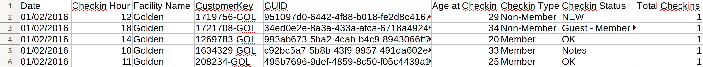
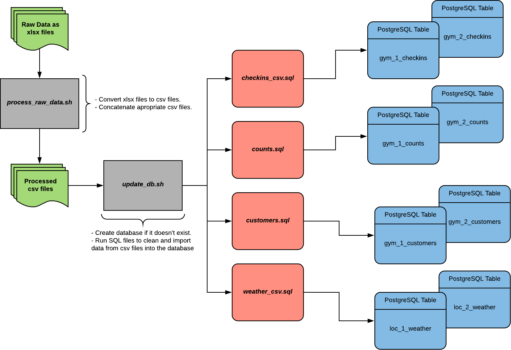

# **Climbing Gym Data Pipeline**

    </img>

## Table of Contents

1. [Purpose](#purpose)
3. [The Data](#the-data)
4. [The Pipeline](#data-pipeline) <-- Click here to get to the good stuff!
5. [Cleaning](#cleaning)

# Purpose

My project with Earth Treks is to leverage their data to deliver insights. Focusing on how to make better decisions about new gym locations. I started with data from the Denver area but I needed to develop the infrastructure to quickly analyze new data from different areas. In order to do this, I created a PSQL pipeline to take multiple raw .xlsx files and create a cleaned and organized PSQL database.

# The Data

The data for this analysis was obtained from Earth Treks Climbing and Fitness.

    </img>

## Check-in Data

Check-in data was obtained from Earth Treks Climbing and Fitness for gyms in the Denver area. The data was received as a series of .xlsx files with the following format:

</img>

Each row represents a single check-in to the gym. Each column is described below:

|COLUMN|DESCRIPTION|
|---|---|
|`Date`|the date of the check-in.|
|`Checkin Hour`|the specific hour of the check-in.|
|`Facility Name`|The name of the gym.|
|`Customer Key`|A key associated with the customer that can change over time. The suffix `GOL` is displaying the current users home gym. A home gym is the gym that the person has checked into the most.|
|`GUID`|is the unique id associated with the person checking in.|
|`Age at Checkin`|the age of the person at check-in.|
|`Checkin Type`|Whether the person is a member or not at the time of check-in.|
|`Checkin Status`|Notes on the type of check-in. Most common values: `OK`, `Guest - no membership`, `NEW`, `Notes`, `Guest - Member guest pass`
|`Total Checkins`|either a 1 or 0. Not sure what this column means.|

I received data from two gyms from when each gym opened until December 11, 2019.

- Golden gym: XXX check-ins from November 22, 2013 - December 11, 2019
- Englewood gym: XXX check-ins from August 30, 2018 - December 11, 2019

Older gyms had multiple .xlsx files spanning multiple years. Below is an example of the raw data folder:

    - data/raw/    
        'Englewood Check Ins 2018-121319.xlsx'  
        'Golden Check Ins 2013-2015.xlsx'  
        'Golden Check Ins 2016-2017.xlsx'  
        'Golden Check Ins 2018-121119.xlsx'

## User Data

User data was aggregated from the check-in data and then supplemented with additional data from customer tables.

|COLUMN|DESCRIPTION|
|---|---|
|`Home Gyms`|How many different home gyms are listed for this user.|
|`Current Home Gym`|Current home gym.|
|`First Checkin`|First check-in in check-in table for each user.|
|`Last Checkin`|Last check-in in check-in table for each user.|
|`Member Checkin Counts`|Number of check-ins for user with type 'MEMBER'.|
|`Non-Member Checkin Counts`|Number of check-ins for user with type 'NON-MEMBER'.|
|`Total Checkin Counts`|Number of total check-ins for user.|
|`Min Age`|Age at first Check-in.|
|`Max Age`|Age at last Check-in.|
|`Customer Type`|Type of user as of 1/27/20.|
|`Address 1`|Address line 1 of user at first check-in.|
|`Address 2`|Address line 2 of user at first check-in.|
|`City`|City of user at first check-in.|
|`State`|State of user at first check-in.|
|`Zip`|Zip code of user at first check-in.|
|`Belay`|Belay Proficiency as of 1/27/20 (None, TR, Lead).|
|`Status`|Membership Status|
|`Distance`|Distance from user reported address to gym. Calculated from Google's Distance Matrix API (Google Maps)|
|`Duration`|Duration from user reported address to gym. Calculated from Google's Distance Matrix API (Google Maps)

I received data for check-ins at the two gyms from when each gym opened until December 11, 2019. Customer data was received January 27, 2020.

- Golden gym: XXX users from November 22, 2013 - December 11, 2019 and customer table data on January 27, 2020.
- Englewood gym: XXX check-ins from August 30, 2018 - December 11, 2019 and customer table data on January 27, 2020.

## Weather Data

    </img>

In order to compare the gym check-in data with the weather, I need to have historical data for the area around the gyms that has been recorded hourly. There is a National Renewable Energy Laboratory (NREL) Solar Radiation Research Laboratory (SRRL) in Golden. The facility has been collecting and storing hourly weather data since 1981. This data is all available online which can be downloaded as csv files. The station is about 2 miles from the Golden gym and about 11 miles from the Englewood gym. Most of the sensors that are available are for solar data but there is a multitude of sensors that are specifically weather that seems pertinent to whether a person would decide to go to the gym.

The columns of the raw data are:  

|COLUMN|DESCRIPTION|
|---|---|
|`DATE (MM/DD/YYYY)`|The day of the observation in MST|
|`HOUR-MST`|The hour of the observation in MST|
|`Avg Deck Dry Bulb Temp [deg C]`|The average hourly dry bulb temperature taken at the deck (near the ground) in degrees Celsius|
|`Avg Total Cloud Cover [%]`|The average hourly cloud cover including semi-transparent clouds|
|`Avg Opaque Cloud Cover [%]`|The average hourly cloud cover of only opaque clouds|
|`Avg Avg Wind Speed @ 6ft [m/s]`|The average hourly wind speed taken at 6ft in m/s|
|`Avg Avg Wind Speed @ 19ft [m/s]`|The average hourly wind speed taken at 19ft in m/s|
|`Avg Precipitation [mm]`|The average hourly precipitation in mm|
|`Avg Snow Depth [cm]`|The average snow depth in cm|

# Data Pipeline

We may want to include new gyms in our analysis/model in the future. In order to allow for scaleability, it was beneficial to set up a data pipeline that takes in data from a series of raw .xlsx files and builds an organized and cleaned PostgreSQL database.

Below is a visual representation of the data pipeline:

</img>

Running *process_raw_data.sh* processes the raw files to run the *update_db.sh* script. Running *process_and_updatedb.sh* will run both scripts and create and update the database.

The SQL scripts clean the data before going into the database. Some of the more notable cleaning steps are below.

# Cleaning

### Duplicate Check-ins

Throughout the data there were duplicate check-ins. Either a person checked in twice within the same hour or the system registered their check-in twice. There were also check-ins from the same person on the same day. This could mean that they checked in, left, and came back later. Counting both check-ins is reasonable when they are a significant time apart i.e. 6 am and 5 pm. But there were check-ins that were only a few hours apart. It is unlikely that a person checked in, used the gym, left, came back and checked back in within this short time frame. Therefore I only kept the first check-in for a given person  that checked in multiple times within 4 hours using a SQL CROSS JOIN.

| GUID                                 | Date       |   Checkin Hour |
|:-------------------------------------|:-----------|---------------:|
| f4771ea1-3990-4897-8f7c-f4d849b3c501 | 11/22/2013 |             11 |
| f4771ea1-3990-4897-8f7c-f4d849b3c501 | 11/22/2013 |             12 |
| 559e4eae-3e3e-4735-b5b5-2997ff26f4a8 | 11/22/2013 |             11 |
| 559e4eae-3e3e-4735-b5b5-2997ff26f4a8 | 11/22/2013 |             11 |
| 559e4eae-3e3e-4735-b5b5-2997ff26f4a8 | 11/22/2013 |             11 |

### Hours of Operation

It is important to accurately portray hours that no one checks in. Aggregating the check-in data by hour leaves these hours out and resampling the entire dataset by hour includes 0s when the gym is closed.

In order to get proper values when aggregating, it is important to only include hours that the gym is open. This was done in SQL by creating a temporary table with columns `date` and `hour` that the gym is open and joinning the hourly check-in counts to it.

I only include days that the `tot_checkins > 50` in order to account for days the gym is closed like Christmas or Thanksgiving. Many days have only a few check-ins in a day. This is unlikely if the gym was open to the public. This also captures days where I assume their are just test check-ins.

### Weather

Cleaning the weather data required some unit conversion, null value replacement and interpolation due to the way the data is recorded and erratic sensor behavior. Most notably, the snow depth data had some difficult to detect spikes that required analyzing the difference of the time series data. A more step by step process can be seen in the [cleaning.ipynb](/notebooks/cleaning.ipynb).
